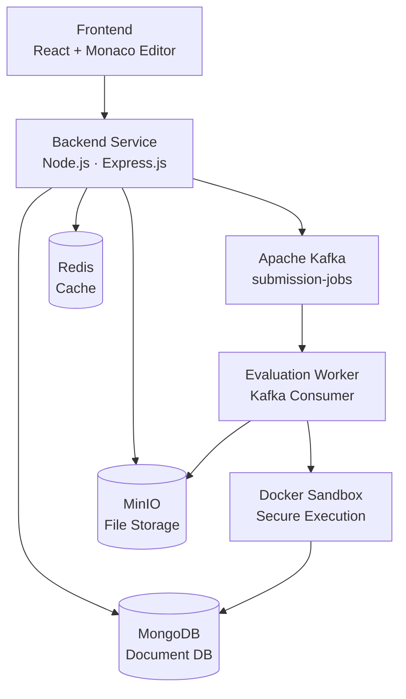
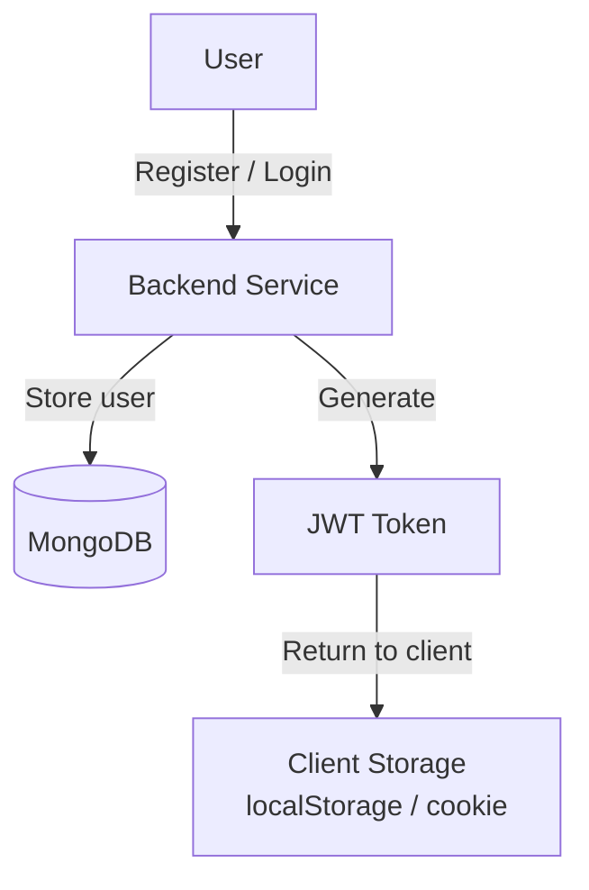
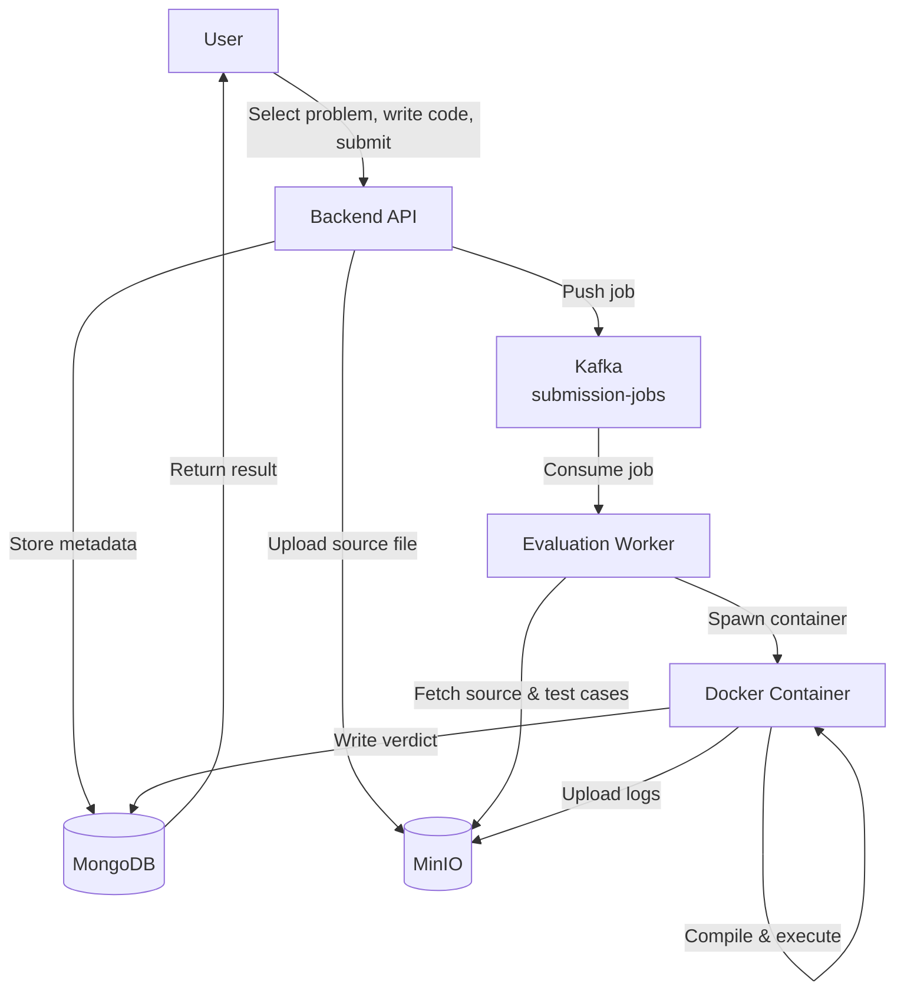

# Online Judge System — High Level Design (HLD)

---

## 1. Overview

### Purpose

The **Online Judge System** is a scalable competitive programming platform where users can solve coding problems, submit solutions, and receive automated verdicts after execution against hidden test cases.

The system is designed to support:

- High concurrent submissions
- Secure sandboxed code execution
- Multi-language compilation and execution
- Contest leaderboards
- Scalable asynchronous evaluation

---

## 2. High-Level Architecture

---

## 3. Core Components

### 3.1 Frontend

Responsible for:

- User registration and login
- Problem listing and browsing
- In-browser code editor
- Submission history
- Leaderboard display
- Contest participation

**Tech Stack:** React.js, Monaco Editor

---

### 3.2 Backend Service

Handles:

- Authentication and JWT validation
- API routing
- Submission processing
- Problem APIs
- Contest APIs

**Tech Stack:** Node.js, Express.js

---

### 3.3 MongoDB

Stores all application data as documents:

- Users
- Problems
- Contests
- Submissions
- Verdicts
- Leaderboards

---

### 3.4 Redis

Used for caching:

- User sessions
- Leaderboards
- Frequently accessed problems
- Recent submissions

---

### 3.5 MinIO

Object storage service used for:

- Source code files
- Test case files
- Execution logs
- Problem assets (images, PDFs)

| Bucket           | Purpose              |
|------------------|----------------------|
| `submissions`    | User source code     |
| `testcases`      | Input/output files   |
| `logs`           | Execution logs       |
| `problem-assets` | Images and PDFs      |

---

### 3.6 Apache Kafka

Acts as the asynchronous message queue.

- **Topic:** `submission-jobs`

**Benefits:**
- Handles traffic spikes gracefully
- Decouples API layer from evaluation
- Improves horizontal scalability

---

### 3.7 Evaluation Worker

Consumes jobs from Kafka and:

- Downloads source code from MinIO
- Downloads test cases from MinIO
- Starts isolated Docker containers
- Executes code per test case
- Generates and writes verdicts

---

### 3.8 Docker Sandbox

Secure, isolated execution environment.

| Constraint   | Value       |
|--------------|-------------|
| CPU Limit    | 1 vCPU      |
| Memory Limit | 256 MB      |
| Network      | Disabled    |
| Filesystem   | Read-only   |
| User         | Non-root    |

---

## 4. Authentication Flow

**JWT Payload:**
- `userId`
- `expiry` (TTL)

---

## 5. Submission Flow

---

## 6. Database Schema

### `users` (MongoDB Collection: `authusers`)

Mapped via the Mongoose model `AuthUser`.

| Field       | Type     | Validation / Constraints                                 | Description                   |
|-------------|----------|----------------------------------------------------------|-------------------------------|
| `_id`       | ObjectId | Automatically generated by MongoDB                       | Primary unique identifier     |
| `firstName` | String   | Required, trimmed, 2-40 chars                            | User's first name             |
| `lastName`  | String   | Required, trimmed, 2-40 chars                            | User's last name              |
| `email`     | String   | Required, unique, trimmed, lowercased, email regex match | User's unique email address   |
| `password`  | String   | Required, min length 6                                   | Secure Bcrypt-hashed password |

---

### `problems` (MongoDB Collection: `problems`)

| Field         | Type     | Validation / Constraints                    | Description                              |
|---------------|----------|---------------------------------------------|------------------------------------------|
| `_id`         | ObjectId | Automatically generated                     | Primary unique identifier                |
| `title`       | String   | Required, trimmed                           | Problem title                            |
| `statement`   | String   | Required                                    | Full problem description and constraints |
| `difficulty`  | String   | Required, Enum: `['Easy', 'Medium', 'Hard']` | Problem difficulty level                 |
| `timeLimit`   | Number   | Required, Integer (ms)                      | Execution time limit                     |
| `memoryLimit` | Number   | Required, Integer (MB)                      | Execution memory limit                   |
| `createdAt`   | Date     | Default: `Date.now`                         | Timestamp when problem was created       |

---

### `submissions` (MongoDB Collection: `submissions`)

| Field           | Type     | Validation / Constraints                                            | Description                            |
|-----------------|----------|---------------------------------------------------------------------|----------------------------------------|
| `_id`           | ObjectId | Automatically generated                                             | Primary unique identifier              |
| `userId`        | ObjectId | Required, Ref: `AuthUser`                                           | The user who submitted the code        |
| `problemId`     | ObjectId | Required, Ref: `Problem`                                            | The problem being solved               |
| `language`      | String   | Required, Enum: `['cpp', 'python', 'java', 'javascript']`           | Programming language used              |
| `code`          | String   | Required                                                            | Source code or reference to MinIO path |
| `verdict`       | String   | Required, Enum: `['AC', 'WA', 'TLE', 'MLE', 'RE', 'CE', 'PENDING']` | Verdict of execution                   |
| `executionTime` | Number   | Optional, Integer (ms)                                              | Actual execution time taken            |
| `memoryUsed`    | Number   | Optional, Integer (MB)                                              | Actual memory consumed                 |
| `createdAt`     | Date     | Default: `Date.now`                                                 | Submission timestamp                   |

---

## 7. Verdict Reference

| Verdict | Full Form               | Description                                      |
|---------|-------------------------|--------------------------------------------------|
| `AC`    | Accepted                | All test cases passed                            |
| `WA`    | Wrong Answer            | Output doesn't match expected                    |
| `TLE`   | Time Limit Exceeded     | Execution exceeded allowed time                  |
| `MLE`   | Memory Limit Exceeded   | Memory usage exceeded allowed limit              |
| `RE`    | Runtime Error           | Program crashed during execution                 |
| `CE`    | Compilation Error       | Code failed to compile                           |

---

## 8. Scalability Design

| Strategy              | Approach                                                      |
|-----------------------|---------------------------------------------------------------|
| Horizontal Scaling    | Evaluation workers scale independently via Kafka consumers    |
| Traffic Buffering     | Kafka queues absorb submission bursts during contests         |
| Cache Layer           | Redis reduces database read load on hot data                  |
| Stateless API         | Enables easy backend horizontal scaling behind a load balancer|

---

## 9. Security Design

| Layer             | Mechanism                                         |
|-------------------|---------------------------------------------------|
| Authentication    | JWT-based, short-lived tokens                     |
| Sandbox Isolation | Isolated Docker container per submission           |
| File Access       | Files stored in MinIO, accessed via presigned URLs |
| Network Isolation | No outbound internet access inside containers      |
| User Isolation    | Containers run as non-root user                   |

---

## 10. Non-Functional Requirements

| Requirement         | Target    |
|---------------------|-----------|
| Concurrent Users    | 1,000+    |
| Evaluation Latency  | < 5s      |
| API Response Time   | < 200ms   |
| Availability        | 99.9%     |

---

## 11. Technology Stack

| Layer              | Technology                  |
|--------------------|-----------------------------|
| Frontend           | React.js, Monaco Editor     |
| Backend API        | Node.js, Express.js         |
| Database           | MongoDB (Mongoose ODM)      |
| Cache              | Redis                       |
| Object Storage     | MinIO                       |
| Message Queue      | Apache Kafka                |
| Code Execution     | Docker (sandboxed)          |

---

## 12. Future Enhancements

- [ ] Kubernetes deployment with auto-scaling workers
- [ ] WebSocket-based live verdict streaming
- [ ] Plagiarism detection engine
- [ ] Distributed MinIO for high availability storage
- [ ] Multi-region deployment
- [ ] Support for more programming languages
- [ ] Editorial and solution discussion sections

---

## 13. Project Goals

| Goal                         | Detail                                        |
|------------------------------|-----------------------------------------------|
| Scalable Architecture        | Kafka + stateless workers + Redis caching      |
| Secure Execution             | Isolated Docker sandbox with strict limits     |
| Fast Verdict Generation      | Target < 5s end-to-end evaluation             |
| High Availability            | 99.9% uptime SLA                              |
| Contest-Ready Infrastructure | Handles 1000+ concurrent submissions          |

---

*This document is for educational and learning purposes.*  
*Author: Platform Engineering Team*